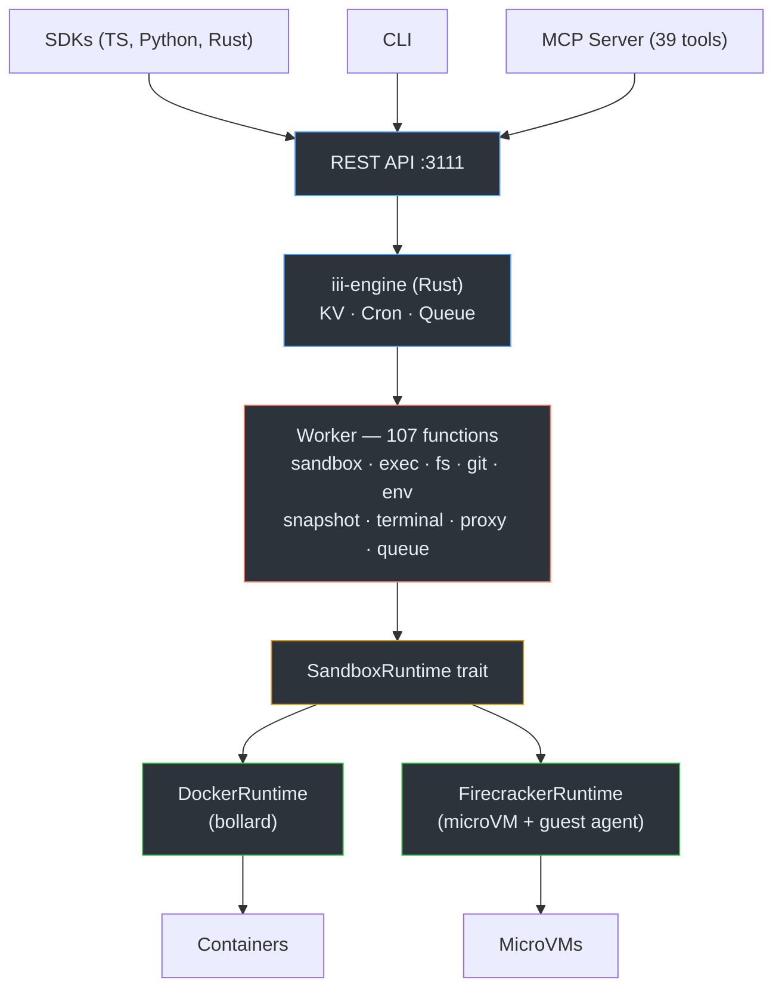

# iii-sandbox

Isolated code execution sandboxes with a full API. Rust worker on [iii-engine](https://github.com/iii-hq/iii) primitives. Docker or Firecracker backends.



## Quick Start

```bash
git clone https://github.com/iii-hq/sandbox.git && cd sandbox
pnpm install && pnpm build

# Start iii-engine
iii --config iii-config.yaml

# Start worker
cd packages/worker && cargo run

# Create a sandbox and run code
curl -X POST http://localhost:3111/sandbox/sandboxes \
  -H "Content-Type: application/json" \
  -d '{"image": "python:3.12-slim"}'

curl -X POST http://localhost:3111/sandbox/sandboxes/<id>/exec \
  -H "Content-Type: application/json" \
  -d '{"command": "python3 -c \"print(2+2)\""}'
```

**Requires**: Docker, Node.js 20+, pnpm 9+, Rust 1.82+, [iii-engine](https://github.com/iii-hq/iii) binary

## Packages

| Package | What | Path |
|---------|------|------|
| `iii-sandbox-worker` | Rust binary (107 functions, 104 triggers) | `packages/worker` |
| `@iii-sandbox/sdk` | TypeScript client (zero-dep) | `packages/sdk` |
| `iii-sandbox` | Python client (httpx + pydantic) | `packages/sdk-python` |
| `iii-sandbox` | Rust client (reqwest + serde) | `packages/sdk-rust` |
| `@iii-sandbox/cli` | CLI (11 commands) | `packages/cli` |
| `@iii-sandbox/mcp` | MCP server (39 AI tools) | `packages/mcp` |

## SDK

### TypeScript

```typescript
import { createSandbox } from "@iii-sandbox/sdk"

const sbx = await createSandbox({ image: "python:3.12-slim" })

const result = await sbx.exec("python3 --version")
console.log(result.stdout)

await sbx.filesystem.write("/workspace/app.py", "print('hello')")
const content = await sbx.filesystem.read("/workspace/app.py")

const py = await sbx.interpreter.run("print(sum(range(100)))", "python")

await sbx.git.clone("https://github.com/user/repo.git")
const snap = await sbx.snapshot()
await sbx.restore(snap.snapshotId)
await sbx.kill()
```

### Python

```bash
pip install iii-sandbox
```

```python
from iii_sandbox import create_sandbox

sbx = await create_sandbox(image="python:3.12-slim")
result = await sbx.exec("python3 --version")
await sbx.filesystem.write("/workspace/app.py", "print('hello')")
await sbx.kill()
```

### Rust

```toml
[dependencies]
iii-sandbox = "0.1"
tokio = { version = "1", features = ["full"] }
```

```rust
use iii_sandbox::{create_sandbox, SandboxCreateOptions};

let sbx = create_sandbox(SandboxCreateOptions {
    image: Some("python:3.12-slim".into()),
    ..Default::default()
}, None).await?;

let result = sbx.exec("python3 --version", None).await?;
println!("{}", result.stdout);
sbx.kill().await?;
```

## CLI

```bash
iii-sandbox create python:3.12-slim --name my-sandbox
iii-sandbox exec sbx_abc123 "echo hello"
iii-sandbox exec sbx_abc123 "python3 train.py" --stream
iii-sandbox file write sbx_abc123 /workspace/app.py "print('hi')"
iii-sandbox list
iii-sandbox kill sbx_abc123
```

## MCP

Connect AI agents (Claude, Cursor, etc.) to sandboxes:

```json
{
  "mcpServers": {
    "iii-sandbox": {
      "command": "npx",
      "args": ["@iii-sandbox/mcp"],
      "env": { "III_SANDBOX_URL": "http://localhost:3111" }
    }
  }
}
```

39 tools: sandbox lifecycle, exec, filesystem, git, env, process, snapshots, ports, events, streams, observability, monitoring, networking, volumes.

## What's in the Box

**93 REST endpoints** across 17 categories:

| Category | Endpoints | What you get |
|----------|:---------:|-------------|
| Sandbox | 8 | Create, list, get, kill, pause, resume, clone, renew |
| Exec | 10 | Blocking, streaming (SSE), background, queue + DLQ |
| Filesystem | 12 | Read, write, delete, list, search, upload, download, move, mkdir, chmod |
| Git | 9 | Clone, status, commit, diff, log, branch, checkout, push, pull |
| Env | 4 | Get, set, list, delete |
| Process | 3 | List, kill, top |
| Snapshots | 5 | Create, restore, list, delete, clone-from |
| Templates | 4 | CRUD |
| Ports | 3 | Expose, list, unexpose |
| Terminal | 3 | Create PTY, resize, close (via iii channels) |
| Proxy | 2 | HTTP forward to container, CORS config |
| Interpreter | 3 | Run code, install packages, list languages |
| Metrics | 3 | Per-sandbox, global, health |
| Events | 2 | History, publish |
| Streams | 3 | Logs, metrics, events (all SSE) |
| Monitoring | 4 | Set alert, list, delete, history |
| Networks | 5 | Create, list, connect, disconnect, delete |
| Volumes | 5 | Create, list, delete, attach, detach |
| Workers | 5 | List, select, reap, migrate, sweep |

Full reference: [`docs/api-reference.md`](docs/api-reference.md)

## Performance

Measured on macOS arm64 with Docker Desktop. Reproducible via `scripts/test-e2e.sh`.

| Operation | Latency |
|-----------|---------|
| Cold start | 200ms |
| Warm start | 206ms |
| Exec (echo, avg 20x) | 59ms |
| File write | 107ms |
| File read | 179ms |
| Pause | 133ms |
| Resume | 121ms |
| 3x parallel create | 275ms |

**Throughput**: ~16 exec/s, ~13 file I/O cycles/s

### Cold Start vs Competitors

Cold start comparison using published/measured data from vendor docs, independent benchmarks, and our own measurements:

```
  iii-sandbox (Docker)  ██░░░░░░░░░░░░░░░░░░░░░░░░░░░░░░░░░░  200ms
  E2B                   ██▓░░░░░░░░░░░░░░░░░░░░░░░░░░░░░░░░░  150-200ms
  Daytona               ██▓░░░░░░░░░░░░░░░░░░░░░░░░░░░░░░░░░  197ms
  AWS Lambda            █████░░░░░░░░░░░░░░░░░░░░░░░░░░░░░░░  100-500ms
  SlicerVM              ██████████████░░░░░░░░░░░░░░░░░░░░░░░  1-2s
  Fly.io Sprites        ██████████████░░░░░░░░░░░░░░░░░░░░░░░  300ms-2s
  Modal                 ██████████████████░░░░░░░░░░░░░░░░░░░  ~1s
  Runloop               ██████████████████████████░░░░░░░░░░░  ~2s
  Together/CodeSandbox  ██████████████████████████████████░░░  2.7s (P95)
  Kubernetes Jobs       ████████████████████████████████████░  1-15s

  └──────┴──────┴──────┴──────┴──────┴──────┴──────┘
  0    500ms    1s    1.5s    2s    2.5s    3s    5s+
```

| Platform | Cold Start | Isolation | Self-Hosted | License |
|----------|-----------|-----------|:-----------:|---------|
| **iii-sandbox** | **200ms** | Docker + Firecracker | Yes | Apache-2.0 |
| E2B | 150-200ms | Firecracker | BYOC ($) | Proprietary |
| Daytona | 197ms | Docker | Yes | AGPL-3.0 |
| AWS Lambda | 100-500ms | Firecracker | No | -- |
| SlicerVM | 1-2s | Firecracker | $25-250/mo | Proprietary |
| Fly.io | 300ms-2s | Firecracker | No | -- |
| Modal | ~1s | gVisor | No | -- |
| Runloop | ~2s | MicroVM | VPC ($) | -- |
| CodeSandbox | 2.7s (P95) | Docker | No | -- |

### Feature Comparison

|  | iii-sandbox | E2B | Daytona | Modal | SlicerVM | Fly.io | Runloop |
|--|:-----------:|:---:|:-------:|:-----:|:--------:|:------:|:-------:|
| **API Endpoints** | **93** | ~20 | ~25 | ~30 | ~25 | ~15 | ~20 |
| **SDKs** | **TS+Py+Rust** | TS+Py+Go | TS+Py+Go | Py | Go | TS+Go+Py | TS+Py |
| **MCP Tools** | **39** | -- | -- | -- | -- | -- | -- |
| **Filesystem Ops** | **12** | 5 | 6 | 2 | 2 | 1 | 3 |
| **Git Ops** | **9** | -- | API | -- | -- | -- | API |
| **Code Interpreter** | **3** | 1 | -- | -- | -- | -- | -- |
| **Queue + DLQ** | **5** | -- | -- | Queues | -- | -- | -- |
| **Snapshots** | Create/Restore | Mem+FS | Archive | Mem | ZFS | Checkpoint | Disk |
| **Terminal** | PTY+channels | PTY | SSH | PTY | SSH | SSH | PTY |
| **HTTP Proxy** | 2-tier+CORS | -- | -- | Webhooks | -- | Proxy | -- |
| **Isolation** | Docker+**FC** | FC | Docker | gVisor | FC | FC | MicroVM |
| **Self-Hosted** | **Apache-2.0** | BYOC ($) | AGPL-3.0 | No | $25-250/mo | No | VPC ($) |

Sources and full analysis: [`docs/competitive-analysis.md`](docs/competitive-analysis.md)

## Isolation Backends

### Docker (default)

Production-ready. Uses bollard for the Docker API. Each sandbox is a container with dropped capabilities, PID limits, network isolation, and resource constraints.

### Firecracker (feature flag)

Full Linux kernel isolation via KVM microVMs. Set `III_ISOLATION_BACKEND=firecracker`.

Each sandbox gets its own kernel, ext4 rootfs (converted from OCI images), and network stack. Host communicates with a guest agent over VSOCK. Supports PTY terminals (16 concurrent sessions), snapshots, and networking via TAP + iptables NAT.

Details: [`docs/architecture.md`](docs/architecture.md)

## Config

```yaml
# iii-config.yaml
modules:
  - type: StateModule
    config:
      adapter: !FileBased
        path: ./data/state_store.db
  - type: RestApiModule
    config:
      port: 3111
      host: "127.0.0.1"
  - type: QueueModule
    config:
      adapter: !Builtin {}
  - type: CronModule
    config:
      adapter: !KvCron {}
```

Key env vars: `III_ENGINE_URL`, `III_AUTH_TOKEN`, `III_MAX_SANDBOXES`, `III_ISOLATION_BACKEND`, `III_POOL_SIZE`

Full list: [`docs/api-reference.md`](docs/api-reference.md#environment-variables)

## Development

```bash
pnpm install && pnpm build
pnpm test                                           # TS SDK/CLI/MCP tests
cd packages/worker && cargo test                     # Rust worker tests (394)
cd packages/sdk-python && pytest                     # Python SDK tests (150)
cd packages/sdk-rust && cargo test                   # Rust SDK tests (32)
cd packages/worker && cargo test --features firecracker  # Firecracker tests (48 + 6 E2E)
bash scripts/test-e2e.sh                             # End-to-end (26 tests + benchmarks)
```

**~941 tests** total across TypeScript, Python, and Rust.

## Repo Layout

```
packages/
  worker/         Rust binary (107 functions, 6.6 MB)
  sdk/            TypeScript client
  sdk-python/     Python client
  sdk-rust/       Rust client
  cli/            CLI
  mcp/            MCP server (39 tools)
  guest-agent/    Firecracker guest agent (std-only Rust)
scripts/          E2E tests, kernel fetch, init builder
docs/             API reference, architecture, competitive analysis
```

## License

Apache-2.0
